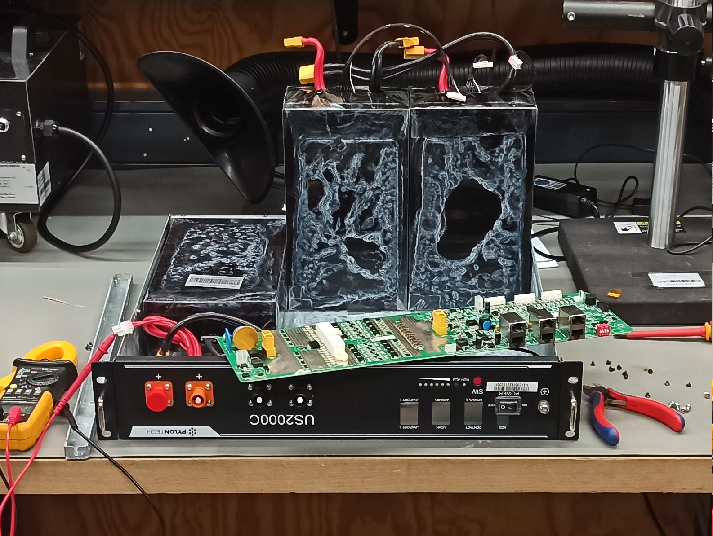

# Solar System

Build thread (german) at https://chaos.social/@patagona/113149877881417810

## Batteries
Basically, what drove me to start this project.

Someone was selling three Pylontech battery modules (1x US2000C, 2x US2000, each 15S LiFePo4, 2.4kWh) for really, really cheap (<25€/kWh) because they were water damaged.

So of course, I picked them up and as expected, the BMS PCBs were corroded to the point of not being feasible to repair (mostly due to the half-assed "conformal coating" applied to the PCBs), but the battery cells themselves were fine, albeit still a bit wet, limescale everywhere and a bit unbalanced.

After opening up the packs, letting them dry, cleaning up the limescale/corrosion and balancing them, all of the cells seem to be fine.

### BMS
To replace the corroded BMS I decided to get DALY 15S 100A "Smart" BMS modules. To mount them, I designed some adapter / mounting plates that fit the original mounts / standoffs of the Pylontech battery modules.

The design files can be found in `cad/bms-mount`.

## Inverter
I decided to go with a "EASun ISolar-SMH-II-7KW" (which is produced by the OEM "Voltronic", similar/equal devices are also sold under the names "MPPSolar", "PowMr", "Powland", "FSP", ...), mostly because it was cheap and has a lot of output power.

It wouldn't go up to the advertised 6.2kW in my testing (it already showed 99% load at around 5.4kW), but that might be battery current limited due to the relatively low battery voltage (15S LiFe instead of 16S LiFe or lead acid, still 120A!), so in combination with the solar input or with a higher input voltage, it should go even higher.

It also has a RS232/RS485 interface which can be used to read data from the inverter (using a custom mostly-ASCII-based protocol) and which has been implemented by several people already:

- https://github.com/jblance/mpp-solar
- https://esphome.io/components/pipsolar.html

### Inverter Box
The inverter will be mounted in a 60x40x22cm euro container for easy transport and water-resistance, along with all the other necessary support hardware (circuit breakers, etc.).

CAD planning is done in `cad/box`.

#### Front Panel
There will be a front panel exposing all the important connections (DC, AC, PV) on the short side of the euro container.

CAD planning is done in `cad/frontpanel`.

## Lessons Learned

### You Get What You Pay For #1: RS485 Transceiver Modules

The (pretty common) RS485 transceiver modules I used for inverter communication _do_ have a ground pin on the RS485 side. This does, however not mean it is actually connected to anything meaningful.

Actually, there is _no connection_ between the TTL- and RS485-side ground, which means any stray electric current flows directly into the A/B inputs of the RS485 transceiver.

In some cases (for example, when both the PV input and the MCU are ground-referenced, even just through a Y-capacitor of a PSU) there may be something like 90V AC at 700µA between the two sides of the RS485 transceiver, killing it pretty much instantly.

Running a wire from the TTL-side ground to the RS485-side ground fixes that issue by giving the stray currents a direct path to flow.

### You Get What You Pay For #2: Inverter
At one point, the inverter just stopped working (when switching it on, it turned off itself after a few seconds). Turns out, there is an (undocumented) "cold start" voltage, that is hard-coded to be ~4V above the low-voltage cutoff. Means, when the low voltage cutoff is set to 45V, the inverter will just not start below ~49V.

Also, the battery voltage readout was wrong by around 0.7V, however that could be fixed through a serial command.