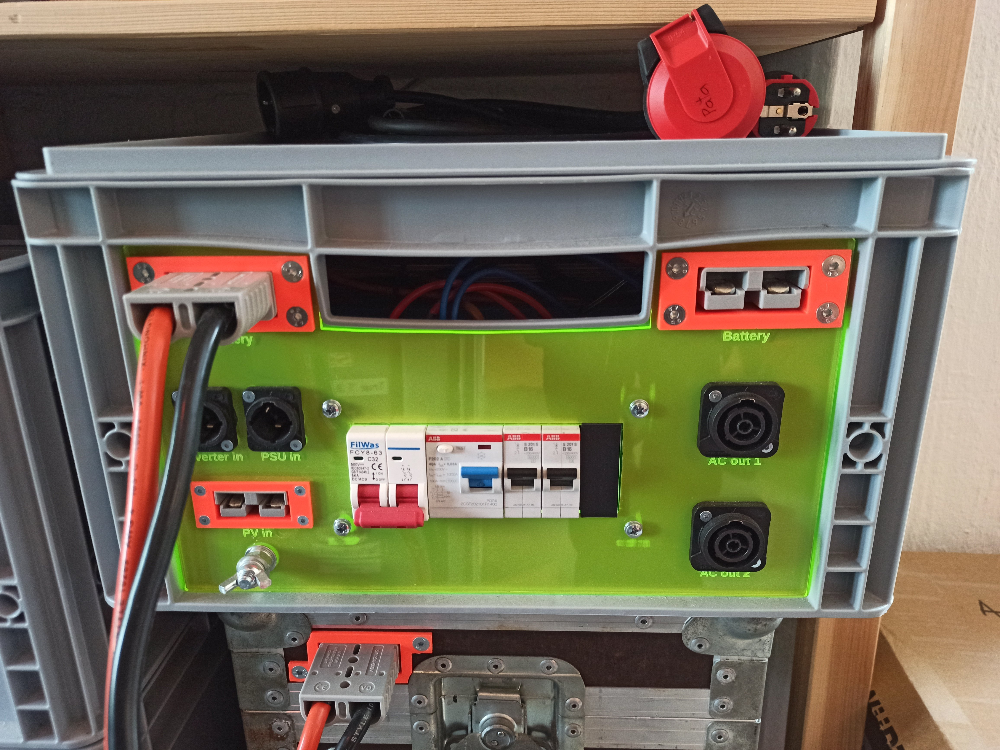
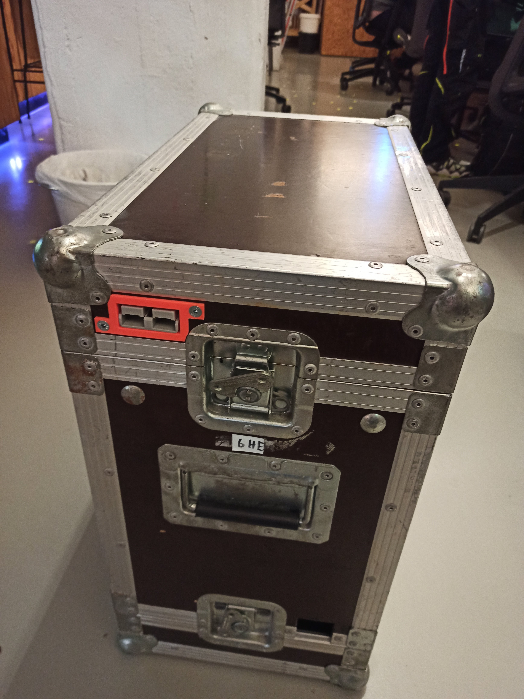
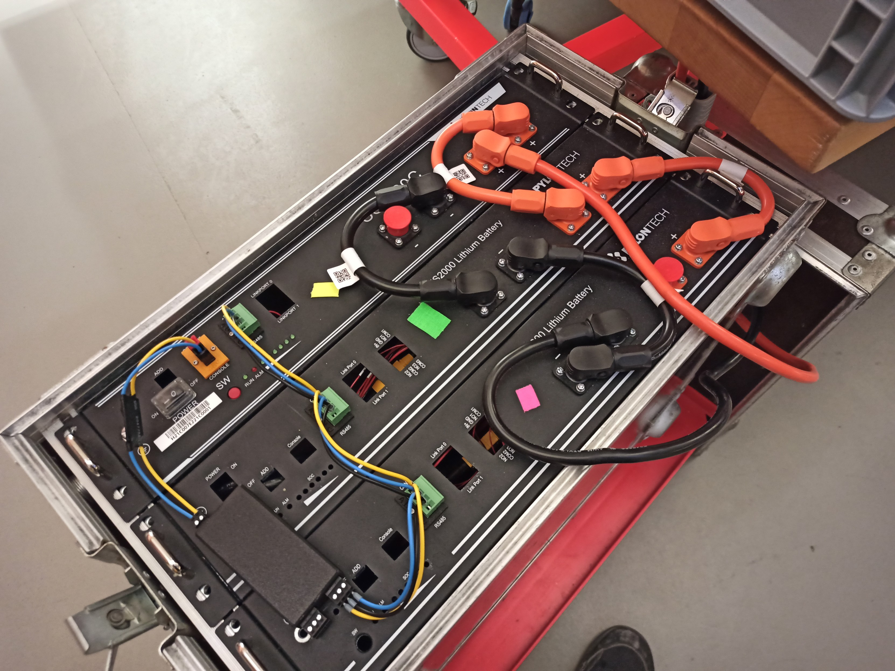
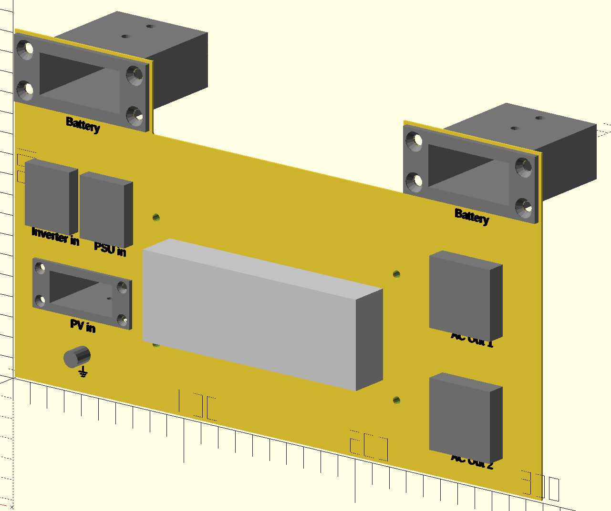

# Solar System

Build thread (german) at https://chaos.social/@patagona/113149877881417810

## Overview

This is sort-of build log / lessons learned of my off-grid solar system / battery backup.

Specs/Features:
- ~7.2kWh battery
- \>5kW AC out
- 5kW PV in
- 2kW AC in (with configurable power limit)

## Batteries
Basically, what drove me to start this project.

Someone was selling three Pylontech battery modules (1x US2000C, 2x US2000, each 15S LiFePo4, 2.4kWh) for really, really cheap (<25€/kWh) because they were water damaged.

So of course, I picked them up and as expected, the BMS PCBs were corroded to the point of not being feasible to repair (mostly due to the half-assed "conformal coating" applied to the PCBs), but the battery cells themselves were fine, albeit still a bit wet, limescale everywhere and a bit unbalanced.

After opening up the packs, letting them dry, cleaning up the limescale/corrosion and balancing them, all of the cells seem to be fine.

### BMS
To replace the corroded BMS I decided to get DALY K-Series 15S 100A "Smart" BMS modules.

If they had been available then, I'd probably have gone with the new DALY 100Balance BMS with 1A active balancing because the passive balancing of the K-Series is a bit weak for these huge cells.

#### Mount

To mount the BMS, I designed some adapter / mounting plates that fit the original mounts / standoffs of the Pylontech battery modules.

The design files can be found in `cad/bms-mount`.

#### Protocol
The BMS has a UART, RS485 and CAN interface. There is already a DALY BMS integration using a UART interface in ESPHome, however that is for the older DALY BMS, not the new H/K/M/S-Series (for which there is already a [GitHub issue](https://github.com/esphome/issues/issues/5476)).

After looking at the Windows software and the protocol documentation provided in the GitHub issue, I implemented the new protocol as an ESPHome component which I've released under [patagonaa/esphome-daly-hkms-bms](https://github.com/patagonaa/esphome-daly-hkms-bms).

### Case
For transport, the batteries are mounted in a used flight case.
I'm using an Anderson-style connector as interconnect between battery and inverter (and other loads), which I've mounted towards the outside of the case so it can be used with the lids on.

There are two parts two the mount:
one that holds the connector (`cad/battery-connector-mount/battery-connector-mount.scad`)
and one for between mount and plug so the mount doesn't get squeezed when tightening the screws (`cad/battery-connector-mount/plug-fill-adapter.scad`).
The mount has later been adapted to be a lot stronger (due to not having to fit in the tight space on the lid) for the front panel.

## Inverter
I decided to go with a "EASun ISolar-SMH-II-7KW" (which is produced by the ODM "Voltronic", similar/equal devices are also sold under the names "MPPSolar", "PowMr", "Powland", "FSP", ...), mostly because it was cheap and has a lot of output power.

It wouldn't go up to the advertised 6.2kW in my testing (it already showed 99% load at around 5.4kW), but that might be battery current limited due to the relatively low battery voltage (15S LiFe instead of 16S LiFe or lead acid, still 120A!), so in combination with the solar input or with a higher input voltage, it should go even higher.

#### Protocol

The inverter has a RS232/RS485 interface which can be used to read data from the inverter (using a custom mostly-ASCII-based protocol) and which has been implemented by several people already:

- https://github.com/jblance/mpp-solar
- https://esphome.io/components/pipsolar.html

### Inverter Box
The inverter is mounted on a plate in a 60x40x22cm euro container for easy transport and (at least minimal) water-resistance,
along with all the other necessary support hardware (circuit breakers, etc.).

Files in `cad/box`.

#### Front Panel
There is a laser-cut front panel exposing all the important connections (DC, AC, PV) on the short side of the euro container.

Files in `cad/frontpanel` (also includes the SB50/SB120 mounts, DIN rail mounts, etc.).

#### Air Duct
To prevent overheating, an air duct was designed (in Fusion) and 3D printed to direct the warm air from the
inverter fans directly out the Eurobox handle.

Files in `cad/air-duct`.

## PSU
To be able to limit the AC power input (for charging the batteries with a small generator) a Huawei R4830 PSU has been added to the inverter box as well.

See my [Documentation](https://github.com/patagonaa/huawei-r48xx) and [ESPHome component](https://github.com/patagonaa/esphome-huawei-r4850) for more info about these PSUs.

For this, a second level has been added to the inverter box to hold the PSU, the necessary power distribution blocks and circuit breaker and some additional unrelated hardware (auxilary power circuit breaker, ESP32 board)

## Misc other CAD parts
- `cad/battery-connector-mount`: Panel mount for Anderson SB120 and SB50 connectors
- `din-rail-plug`: Part that fits into the cutout for the DIN rail parts so not each unit has to be filled
- `esp-box`: Case that fits a LilyGO TTGO T-CAN485 board (with CAN bus and RS485) and an RJ45 breakout board for the inverter RS485
    - v2 splits ESP and breakout board in separate cases
- `cad/battery-bus-mount`: Mount for pluggable screw clamps which fits in the Battery RJ45 hole to interface with the BMS RS485
- `cad/battery-aux-power-mount`: Mount for an Anderson Powerpole connector which fits in the Battery RJ45 hole to power an ESP32
- `cad/lxcharger-end-cap`: End cap to replace the default barrel jack of an LXCHARGER H65AC DC-DC USB-C charger with an XT30.
- `cad/mcb-mount`: Part to mount din-rail miniature circuit breakers on a board sideways
- `cad/top-holder`: Holder to mount a board above the inverter to have make space for the PSU, power distribution blocks, etc. (printed with a pause to insert screw nut).

## Lessons Learned

### You Get What You Pay For #1: RS485 Transceiver Modules

The (pretty common) RS485 transceiver modules I used for inverter communication _do_ have a ground pin on the RS485 side. This does, however not mean it is actually connected to anything meaningful.

Actually, there is _no connection_ between the TTL- and RS485-side ground, which means any stray electric current flows directly into the A/B inputs of the RS485 transceiver.

In some cases (for example, when both the PV input and the MCU are ground-referenced, even just through a Y-capacitor of a PSU) there may be something like 90V AC at 700µA between the two sides of the RS485 transceiver, killing it pretty much instantly.

Running a wire from the TTL-side ground to the RS485-side ground fixes that issue by giving the stray currents a direct path to flow.

### You Get What You Pay For #2: Inverter Startup Voltage
At one point, the inverter just stopped working (when switching it on, it turned off itself after a few seconds). Turns out, there is an (undocumented) "cold start" voltage, that is hard-coded to be ~4V above the low-voltage cutoff. Means, when the low voltage cutoff is set to 45V, the inverter will just not start below ~49V.

Also, the battery voltage readout was wrong by around 0.7V, however that could be fixed through a serial command (can be sent using [mpp-solar](https://github.com/jblance/mpp-solar): `mpp-solar --porttype serial -p COM4 -c BTA+01 -I` to increase voltage reading by 50mV, can be run multiple times until the value is correct).

### You Get What You Pay For #3: BMS Communication
The DALY BMS comes with two TTL UART ports, CAN and RS485. The DALY BMS RS485 protocol is well-documented and also implemented in ESPHome.

However, as it turns out, the new (2023?) lineup of BMS from DALY (H/K/M/S series) use another communication protocol. This new protocol is called "Modbus" internally in the PC software and looks just like regular Modbus.

After some messing around with Modbus software and not getting it to work, I figured out that _the reply from the BMS has a different device id than the request_, which makes it completely incompatible with all available Modbus software / libraries, so custom software had to be written _again_ (see [above](#protocol)).

### You Get What You Pay For #4: LilyGO T-CAN485
Again, how hard could it be to do RS485? (answer: apparently very hard)

They use an MAX13487E transceiver, which has "AutoDirection Control", which means instead of driving the bus in both directions, resulting in in [0.4V, 5V, -5V] (idle, mark, space - with proper termination and bias), it only drives it in one direction, relying on the bias for the other direction, resulting in [0.4V, 0.4V, -5V]. This isn't great interfereence-wise, but it works and is spec-compliant.

However, LilyGO chose to terminate the bus with 120Ω and bias it with 4.7kΩ, resulting in the voltages [0.06V, 0.06V, -5V], which just barely may or may not work. They could've omitted the termination, done the biasing right _or_ just use a "normal" transceiver (they have enough GPIOs to do so), but it seems they've instead chosen the perfect combination of parts to make it not work 🤦.

Additionally, they also did the same as [#1: Transceiver Modules](#you-get-what-you-pay-for-1-rs485-transceiver-modules), so the protection circuitry doesn't really protect the transceiver as the protection ground isn't hooked up to the transceiver ground (besides a weak connection through 1MΩ + 1nF).
